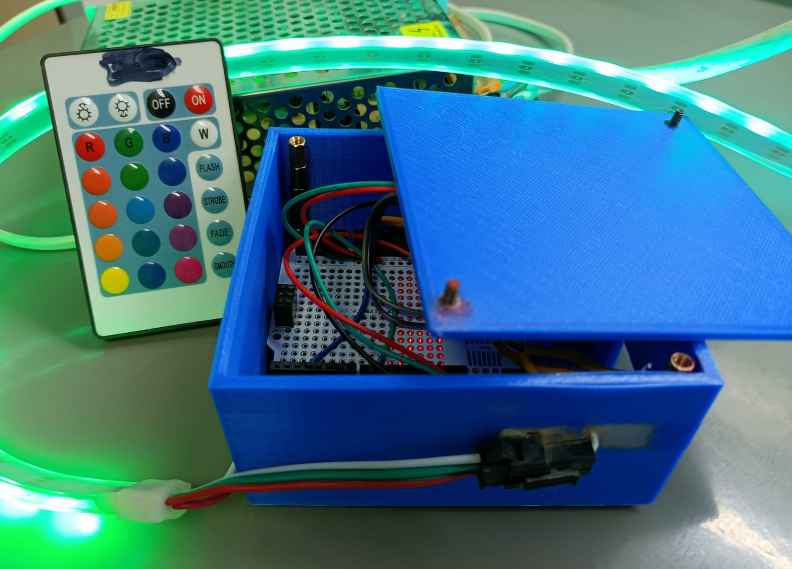

 <h1>Remote Led strip</h1>
 
 <p>In this project we will make Remote led strip.</p>
 <br>
 <br>
 <h1>Components</h1>
 <ul>
 <li><a href="https://store.arduino.cc/products/arduino-uno-rev3/">Arduino uno</a></li>
 <li><a href="https://www.newark.com/vishay/tsop38238/ir-receiver-45m-through-hole/dp/02P9885?COM=ref_hackster&CMP=Hackster-NA-project-05ffde-May-22">Ir reader</a></li>
 <li><a href="https://www.newark.com/adafruit/1507/light-strip-length-1m/dp/26Y8461?COM=ref_hackster">Led strip</a></li>
 <li><a href="https://www.amazon.com/DIGISHUO-Transformer-Switching-Converter-Security/dp/B098RPTWF2/ref=sr_1_11?keywords=power%2Bsupply%2B5V%2B10A&qid=1651676536&sr=8-11&th=1">5V 10A Power supply</a></li>
 <li><a href="https://www.newark.com/stellar-labs/24-14687/kit-contents-eight-25-ft-spools/dp/44AC9034?COM=ref_hackster">Wires</a></li>
  <li><a href="https://store.arduino.cc/products/proto-shield-rev3-uno-size">Proto shield</a></li>
  <li><a href="https://www.newark.com/seco-larm/ca-161t/adapter-dc-plug-terminal-block/dp/13T1949?COM=ref_hackster">Connecter Adpter(male and female)</a></li>
  </ul>
 <h1>Wiring</h1>
 
 
  
  <p>For the start we will connect everything with a breadboard. after you figure everything out you can attach a proto shield and solder everything in.

The led is connected to pin 8

The Ir reader is connected to pin 2.

To power a lot of leds you will need a lot of power that why im using 5v 10a to power everything up.

You can chnage the amounts of led in this line:</p>
```c++
#define NUM_LEDS 300
```
  
<h1>Connecting each button from remote:</h1>
<p>In the code you will find that every time you press an ir device it will print out the HEX of the button. Before uploading the code you will need to bind the code to the button HEX. exmaple:

When I press the on Button it prints FFE01F so above the code in the #define on

I will write the FFE01F (make sure to add 0x before so it will be 0xFFE01F)</p>
```c++
#define ON 0xFFE01F
```
<p>After you bind every button you can uplod the code.</p>
<h1>Usage:</h1>
<p>In the code there is couple of patterns i made. I connected them to my remote. if you press the pattern button the pattern will start, once you press any button the pattern will stop.</p>
<h1>Box and Closing:</h1>
<p>After you see everything is working(after the breadboard) solder everything up to the proto shield

I made a 3d box you can print to hold the arduino. You can find the box in the file below.</p> 
<h1>Warning</h1>
<p><b>Working with high power is very dangers and you will need to be careful.
</b></p>
<h1>More Info</h1>
<p>Contact me or more info at Arduino Project \https://projecthub.arduino.cc/dzh121/remote-led-lights-845741</p>
